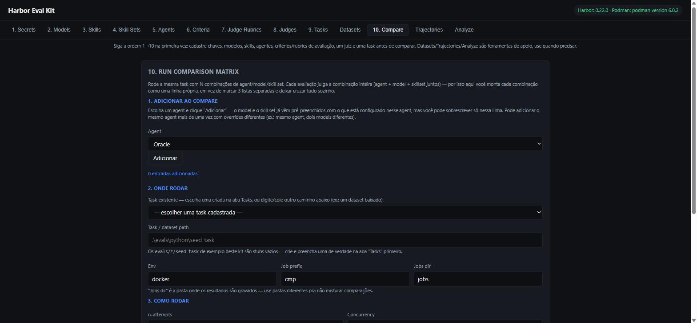

# Harbor Eval Kit

A **Podman-only** (no Docker) local GUI + CLI for installing, running, and comparing
coding-agent evals with the [Harbor Framework](https://github.com/harbor-framework/harbor) —
model vs. model, agent vs. agent, skill ablation, and an optional LLM-judge layer on top of
the deterministic test reward.

> 📖 **Full documentation, step-by-step install, and the reasoning behind every decision:
> [`DOCUMENTACAO.md`](./DOCUMENTACAO.md)** (in Portuguese). This README is the quick tour;
> that file is the complete reference.

## Why this exists

Harbor itself is model/runtime-agnostic, but its Docker-oriented backend doesn't just talk to
Podman out of the box on any platform — the fix differs per OS (a Docker-pipe mismatch on
Windows, a per-machine socket path on macOS, usually nothing needed on native Linux). This
kit detects the OS and resolves the right one automatically — see
[the compatibility gate](./DOCUMENTACAO.md#4-o-gate-de-compatibilidade-podmanharbor-windows-macos-linux)
for the exact mechanism per platform, and its honest caveat: the Windows path has been
validated end-to-end with real runs; macOS/Linux have the resolution logic validated in
isolation, not yet a live run on real hardware. This kit:

- Never installs Docker — validates and uses **Podman** as the container runtime.
- Explicitly gates on Podman↔Harbor compatibility before declaring anything "ready", per OS.
- Wraps `harbor run`/`harbor analyze`/`harbor init --task`/`harbor dataset` behind a local
  GUI and a couple of scripts, so you don't need to memorize CLI flags to run a comparison.
- Disables Harbor's own default telemetry (PostHog) and hardens where secrets live — see
  [Security](#security) below.

## Prerequisites

- Windows, macOS, or Linux with [Podman](https://podman.io/) installed and its machine
  running (`podman machine init && podman machine start` on Windows/macOS).
- [`uv`](https://docs.astral.sh/uv/) to install Harbor in an isolated environment.
- Node.js 22.6+ (native TypeScript execution — no `tsc`/`ts-node`/build step for anything
  in `scripts/`).
- API keys for whichever model providers you plan to use (Anthropic, OpenAI, etc.) — entered
  into the GUI's Secrets tab, never as a global environment variable or in any tracked file.

## Quick start

There are two ways to get Harbor itself installed: let a coding agent do it via the bundled
skills, or run the commands yourself. Either way, ends with the same local GUI.

### Option A — let Claude Code (or Codex/another agent) install it for you

This repo ships its own install runbook as a **skill**: `Harbor_install/skills/harbor-bootstrap/SKILL.md`.
It's plain markdown with a numbered procedure (snapshot existing tools → install `uv` if
missing → `uv tool install harbor` → validate → gate on Podman compatibility with a real
minimal task → persist what was done) — any coding agent that can read a file and run shell
commands can follow it, not just Claude Code specifically:

- **Claude Code**: open this repo and ask `"install Harbor Eval Kit"` — `CLAUDE.md` at the
  root already points Claude Code at the right skill file for install/doctor/eval/cleanup
  requests, so it picks up `harbor-bootstrap` on its own.
- **Codex / GPT-based agents**: point it at the file directly, e.g. *"follow the procedure in
  `Harbor_install/skills/harbor-bootstrap/SKILL.md` step by step, asking me before anything
  destructive"*. There's nothing Claude-specific in the file itself.

The doctor/cleanup counterparts (`harbor-doctor`, `harbor-cleanup`) work the same way —
`"diagnose my Harbor setup"` / `"uninstall Harbor Eval Kit"`.

### Option B — do it yourself

```bash
# 1. Install Harbor in an isolated environment
uv tool install harbor

# 2. Make sure Podman is up and compatible with Harbor's Docker-oriented backend
podman machine init && podman machine start   # if not already running
```

### Enable and start the GUI

Either option above gets you to the same place — a script that checks Harbor/Podman are
actually usable and then launches the server:

```bash
# macOS/Linux
./scripts/start-gui.sh
```
```powershell
# Windows
.\scripts\start-gui.ps1
```

Both scripts are idempotent (safe to re-run), print exactly what's missing if something isn't
ready yet, and exit with a clear error instead of a stack trace if Harbor/Podman aren't found.
Once running: **http://127.0.0.1:4173**.

Then follow the GUI's own tab order, 1 → 10 (Secrets → Models → Skills → Skill Sets →
Agents → Criteria → Judge Rubrics → Judges → Tasks → Compare). See
[`DOCUMENTACAO.md` §2](./DOCUMENTACAO.md#2-instalação-e-configuração--passo-a-passo) for the
fully detailed walkthrough, including the Podman↔Harbor compatibility gate and how to harden
`secrets.env`'s file permissions.

> Anything that goes wrong in `harbor`/`podman` *themselves* (a CLI flag, an adapter, a
> provider integration, a Harbor bug) is outside what this kit controls — check
> [harbor-framework/harbor](https://github.com/harbor-framework/harbor) upstream (issues,
> `harbor --help`, `harbor <command> --help`) before assuming it's this kit's doing. Anything
> about *this repo's own* GUI/scripts/skills is fair game here.

## Two ways to use it

| | GUI (`gui-server.ts`) | CLI (`compare-matrix.ts`) |
|---|---|---|
| Best for | interactive exploration, one-off comparisons, editing tasks/rubrics without leaving the browser | scripting, CI, reproducible sweeps from the terminal |
| Combinations | explicit list of entries (agent + model/skillset overrides), built by hand | full cartesian product via repeatable `--agent`/`--model`/`--skillset` flags |
| State | persists agents/models/skills/rubrics/judges as JSON registries in `~/.harbor-eval-kit/` | stateless — everything passed as flags |
| Output | live table in the browser + CSV/JSON report | terminal table + CSV/JSON report |

Both are thin orchestrators around real `harbor` CLI calls — neither reimplements anything
Harbor already does. Both run **locally**, never as a hosted page, because they need to reach
your local Podman/Harbor installation.

```powershell
# CLI sweep example (PowerShell)
node .\scripts\compare-matrix.ts `
  --path .\evals\python\seed-task `
  --agent claude-code --agent codex `
  --model anthropic/claude-sonnet-5 --model openai/gpt-5.1 `
  --skillset "" --skillset ".\skills\python-eng" `
  --dry-run
```

`node .\scripts\compare-matrix.ts --help` lists every option.

## The GUI, tab by tab



The nav is numbered 1→10 to guide first-time setup; every tab also works standalone
afterward. Each one has inline hints in the UI itself — this is just the map.

1. **Secrets** — provider API keys, stored only in `~/.harbor-eval-kit/secrets.env` (never in
   this repo, never returned by the API after saving). A **Test** button next to each saved
   key makes one real, minimal call (via LiteLLM, the same library Harbor uses) to confirm it
   actually works, and offers to auto-register any models it can discover live for that
   provider.
2. **Models** — `label → provider/model` shortcuts; badges show whether the expected key is
   already in Secrets.
3. **Skills** — a `SKILL.md`'s worth of instructions an agent can receive (write inline,
   attach a `.md`, or point at an existing folder). Optionally bundle example/template files
   alongside it (Anthropic/OpenAI's "progressive disclosure" convention) — Harbor uploads the
   whole skill folder into the agent's environment, not just `SKILL.md`, confirmed against
   its own source.
4. **Skill Sets** — bundle 1+ Skills into a named package to compare as a unit.
5. **Agents** — a "usage profile": which `--agent` Harbor runs, its default model, its own
   instructions, and default skill sets.
6. **Criteria** — one reusable, atomic evaluation question (`name`/`description`/`guidance`)
   an LLM judge answers PASS/FAIL/N-A about a finished run.
7. **Judge Rubrics** — bundle 1+ Criteria into a named rubric, reused across languages/tasks.
8. **Judges** — a judge's "usage profile": which `--agent` executes the judging, which
   (curated, high-tier-only) model, optional custom instructions, and default rubrics.
9. **Tasks** — `harbor init --task` plus an in-browser editor for `instruction.md`,
   `Dockerfile`, `solve.sh`, `test.sh` — no external editor needed. A task can also pin a
   default Judge + rubrics, auto-suggested later in Compare.
10. **Compare** — the core: add an Agent (repeatable, with per-row model/skillset overrides),
    point at a Task, run. Reward, cost, tokens, and duration show up per row; an optional
    **Analyze** panel judges any result afterward (never automatic).

Two support tools, not numbered because they're used situationally, not sequentially:

- **Datasets** — pull a published third-party task suite (`harbor dataset download`); its
  tasks then show up automatically alongside your own in Tasks/Compare.
- **Trajectories** — opens Harbor's own step-by-step viewer (`harbor view`) for a finished
  job, so you can see exactly what an agent did inside the container, not just its reward.

## How comparison actually works

The **reward** from `tests/test.sh` (deterministic — pytest/shell/asserts writing 0/1 to
`/logs/verifier/reward.txt`) *is* the real comparison, the same method SWE-bench/HumanEval
use. **Analyze** (the LLM judge) is a strictly opt-in layer on top, for the cases the cheap
test can't catch: reward hacking, or breaking a tie between candidates that all passed. The
judge model is always locked to a small curated high-tier list — never Harbor's own cheap
default (`claude-haiku-4-5`). Full mechanism, including the N-rubric-per-analysis and
Task↔Judge pinning: [`DOCUMENTACAO.md` §11](./DOCUMENTACAO.md#11-o-mecanismo-de-avaliação--reward-vs-juiz).

## Security

- **Provider API keys** live only in `~/.harbor-eval-kit/secrets.env`, outside this repo, and
  are only ever injected into the environment of the `harbor`/`podman` child process at run
  time — never written to any file this kit tracks or reports.
- **`.gitignore`** defensively excludes `secrets.env`/`.env*` even though they're never
  created inside the repo by design.
- **Harbor's own telemetry is disabled unconditionally** (`HARBOR_TELEMETRY=disabled`
  injected into every `harbor` child process) — confirmed via the installed package's source
  that no API key ever enters that payload, but usage data (models tried, cost, reward) would
  leave the machine by default otherwise.
- Full threat-model writeup, including what *isn't* guaranteed (plain-text file on disk,
  Windows ACL hardening steps): [`DOCUMENTACAO.md` §7](./DOCUMENTACAO.md#7-segurança-das-secrets--o-que-é-garantido-e-o-que-não-é).

## Repo layout

```text
harbor-eval-kit/
├── AGENTS.md, CLAUDE.md          entrypoints for coding agents operating this repo
├── README.md                     you are here
├── DOCUMENTACAO.md                the full reference (PT-BR)
├── config/defaults.env           non-secret default env var names/paths
├── manifests/                    example installation-manifest schema
├── docs/screenshots/             images used in this README
├── Harbor_install/               skills/agents for INSTALLING/OPERATING Harbor itself
│   ├── skills/                     (harbor-bootstrap, harbor-doctor, harbor-cleanup, ...)
│   └── agents/                     — not to be confused with the GUI's own "Agents" tab,
│                                     which is about agent profiles used *inside* evals.
├── scripts/
│   ├── start-gui.sh / .ps1       checks Harbor/Podman, then launches the GUI
│   ├── harbor-eval.sh / .ps1     original bootstrap/doctor scripts
│   ├── compare-matrix.ts         CLI sweep tool (cartesian product via repeatable flags)
│   ├── gui-server.ts             local HTTP server + all /api/* routes
│   └── lib/harbor.ts             shared logic: exec, registries, secrets, materialization
├── gui/index.html                the entire frontend (HTML+CSS+JS, no build step)
└── evals/{java,typescript,python}/   your own tasks (the seed-task/ in each is an empty stub)
```

`jobs/` (Compare/Analyze output) is git-ignored — it's local run history, not project content.
`datasets/` (downloaded task suites), if present, is deliberately **not** ignored — like
`evals/`, it's real project content once you've pulled it down.

## Uninstall safety

Cleanup only ever touches what this kit itself created — a fixed resource prefix
(`harbor-eval-kit-`) and label (`io.harbor-eval-kit.managed=true`), tracked in a local
manifest, with `--dry-run` support. It deliberately never runs `podman rm -a`,
`podman system prune -a`, or any other broad-destructive command, and never touches Podman
itself (Podman is preexisting infrastructure, not something this kit installed).

## Known limitations

- Compare in the GUI is synchronous — no live streaming progress, the page just waits.
- `harbor dataset list` (this Harbor version) only prints a Hub link, not a browsable list.
- A Judge can't be given a real tool-accessible skill (no `--skill` flag on `harbor analyze`)
  — only custom instructions via `--prompt`. Confirmed against Harbor's own source, not a gap
  in this GUI.
- `durationSec` in Compare is wall-clock time for the whole `harbor run` call, not the finer
  per-trial agent-execution timing Harbor records internally.
- The macOS/Linux `DOCKER_HOST` resolution is logic-tested (right `podman` commands, right Go
  template fields), but this kit was built on Windows — only the Windows path has a real,
  repeated, end-to-end `harbor run --env docker`. The GUI's status bar flags it explicitly
  (`⚠ DOCKER_HOST não resolvido`) instead of failing silently if it can't find a value.

Full list with rationale: [`DOCUMENTACAO.md` §13](./DOCUMENTACAO.md#13-limitações-conhecidas-decisões-conscientes-não-esquecimento).
