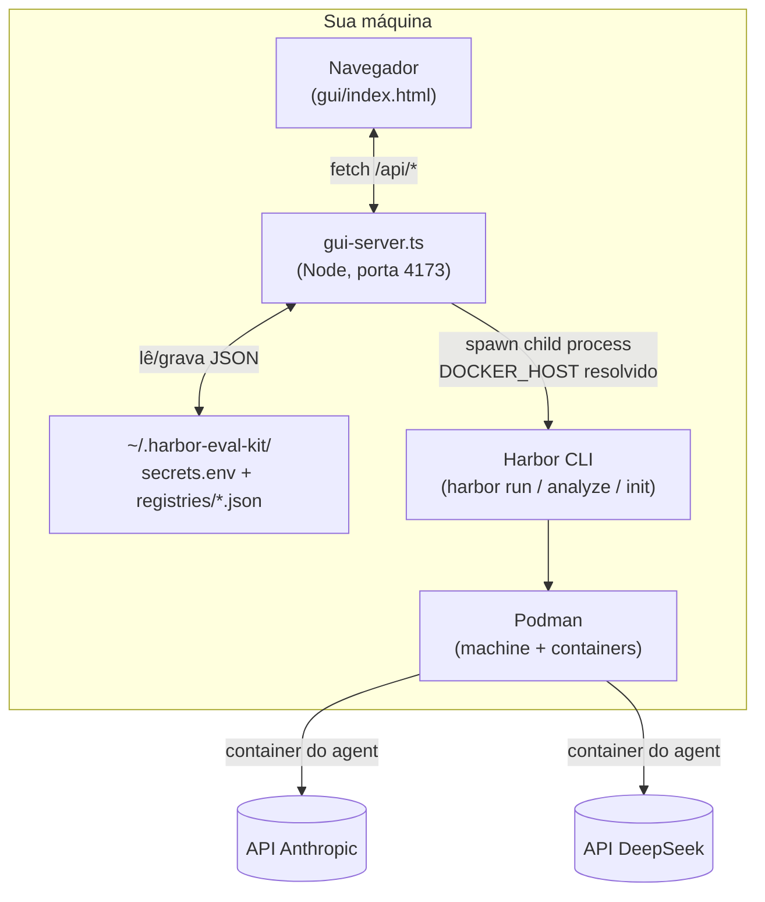
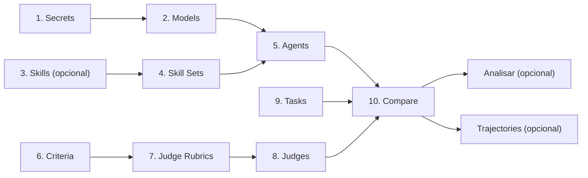
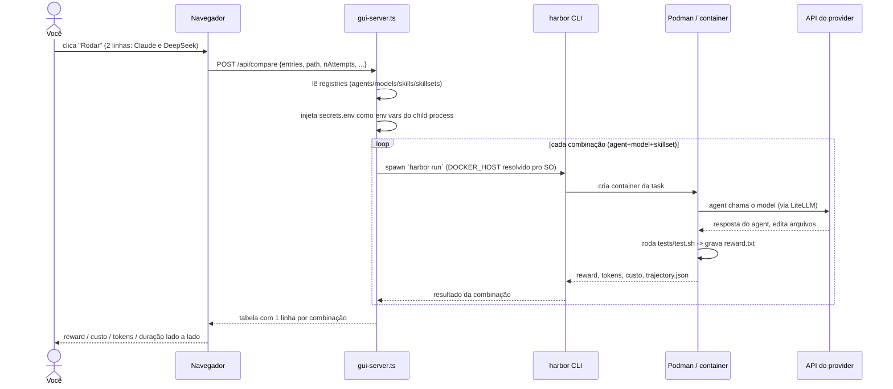

# Como funciona, na prática — guia com diagramas e uma história de uso

Este documento complementa o [`DOCUMENTACAO.md`](../DOCUMENTACAO.md) (referência completa,
aba por aba) com duas coisas que ficam mais fáceis de ver do que de ler em prosa:

1. **Diagramas** de arquitetura e do fluxo de uma execução real.
2. Uma **história de uso** ponta a ponta — comparando **DeepSeek vs Claude** na mesma task
   Python, incluindo um erro real de chave inválida que aconteceu durante os testes deste kit
   (fica como exemplo de troubleshooting, não é hipotético).

Se você só quer o mapa rápido das abas, o README já cobre isso. Aqui o foco é *como as peças
se encaixam* e *como é usar isso do começo ao fim*.

## 1. Visão geral — quem fala com quem

Tudo roda **localmente**. Não existe página hospedada, não existe backend remoto — o
`gui-server.ts` é um processo Node na sua própria máquina, e ele só sabe conversar com o que
está no seu disco e com o `harbor`/`podman` instalados localmente.



Pontos que valem destacar (detalhados no `DOCUMENTACAO.md` §3, §6 e §7):

- O navegador **nunca** fala direto com Harbor/Podman — sempre passa pelo `gui-server.ts`.
- As chaves de API só existem em `secrets.env`, fora do repositório, e só entram no ambiente
  do processo `harbor`/`podman` no exato momento da chamada — nunca voltam numa resposta HTTP.
- Quem realmente fala com a API do provider (Anthropic, DeepSeek, ...) é o **container** onde
  o agent está rodando, não o `gui-server.ts` — a exceção é o botão **Test** da aba Secrets,
  que faz uma chamada mínima direto (via LiteLLM) para confirmar a chave antes de gastar uma
  run inteira com ela.

## 2. A ordem cognitiva das abas, visualmente

A numeração organiza recursos; não obriga a preencher dez abas. O primeiro fluxo é
**Secrets → Models → Agents → Compare**, com `evals/python/soma-fracoes`. Skills e juiz
são opcionais. O grafo abaixo mostra relações entre recursos, incluindo os opcionais:



`Datasets`, `Trajectories` e `Analyze` ficam fora dessa cadeia de pré-requisitos — são
ferramentas de apoio, usadas quando fazem sentido, não passos obrigatórios.

## 3. O que acontece quando você clica "Rodar" no Compare

Este é o caminho de execução real, por trás de um clique só:



O **Analisar** (Judge/LLM) é uma chamada **separada e opcional**, disparada depois, por linha
ou em lote — nunca acontece automaticamente dentro do loop acima. Ver `DOCUMENTACAO.md` §11.

## 4. História de uso: DeepSeek vale a pena para tasks Python do time?

**Contexto.** Rafael quer saber se dá pra trocar Claude por DeepSeek (bem mais barato) nas
tasks Python do dia a dia, sem perder qualidade — e quer isso com números, não achismo.

### 4.1 — Cadastrar e testar as duas chaves (aba 1. Secrets)

1. Provider = `Anthropic` → Name preenche sozinho `ANTHROPIC_API_KEY`, cola o Value → **Save
   key**.
2. Provider = `DeepSeek` → Name preenche `DEEPSEEK_API_KEY`, cola o Value → **Save key**.
3. Clica **Test** em `DEEPSEEK_API_KEY`.

Foi exatamente aqui que aconteceu um erro real durante os testes deste kit — fica registrado
porque é um bom exemplo do que o botão Test é *pra* pegar:

```
Erro: BadRequestError: litellm.BadRequestError: DeepseekException -
{"error":{"message":"Authentication Fails, Your api key: ****1532 is invalid",
"type":"authentication_error","param":null,"code":"invalid_request_error"}}
```

A chave tinha sido revogada no painel da DeepSeek depois de salva aqui. Solução: gerar uma
chave nova em platform.deepseek.com, colar de novo em **Value**, **Save key** (sobrescreve),
**Test** de novo:

```
✓ Key funciona — chamada de teste no model deepseek/deepseek-chat respondeu normalmente.
```

Repete o **Test** em `ANTHROPIC_API_KEY` e confirma o mesmo `✓`. Como as duas chaves suportam
listagem ao vivo de modelos, a GUI mostra um checklist dos modelos descobertos — deixa
marcado, é o próximo passo de qualquer forma.

### 4.2 — Registrar os dois models (aba 2. Models)

Do checklist que apareceu no Test (ou cadastrando à mão):

| Label | provider/model |
|---|---|
| `claude-sonnet-5` | `anthropic/claude-sonnet-5` |
| `deepseek-chat` | `deepseek/deepseek-chat` |

As duas linhas mostram o badge verde de chave configurada.

### 4.3 — Skills / Skill Sets (abas 3 e 4)

Pulado nesta história de propósito: para a comparação ser justa, as duas linhas do Compare
vão usar exatamente as mesmas instruções extras (nenhuma) — variar só o model. Se Rafael
quisesse testar se uma skill de "boas práticas Python" muda o resultado, isso viraria uma
*segunda* comparação (skill ablation, ver `docs/EXPERIMENTS.md`), não a mesma.

### 4.4 — Dois perfis de Agent (aba 5. Agents)

| Nome | agent (Harbor) | model padrão |
|---|---|---|
| `resolvedor-claude` | `mini-swe-agent` | `claude-sonnet-5` |
| `resolvedor-deepseek` | `mini-swe-agent` | `deepseek-chat` |

> **Por que `mini-swe-agent` e não `claude-code`?** O Harbor instalado aceita 42 valores de
> `--agent`, divididos em dois tipos. Os **model-agnostic** (`mini-swe-agent`, `terminus`,
> `aider`, `opencode`, `openhands`, `swe-agent`, `goose`, `langgraph`…) são construídos sobre
> o LiteLLM e aceitam qualquer string `provider/modelo` — são esses que permitem trocar só o
> model mantendo todo o resto igual, que é exatamente o que uma comparação model-vs-model
> exige. Os demais são CLIs de um fornecedor específico (`claude-code`, `codex`, `gemini-cli`,
> `cursor-cli`…) e falam a API daquele fornecedor; combiná-los com um model de outro provider
> é problema do adapter, não algo que este kit garanta. Na aba Agents o campo
> `--agent value` tem autocomplete com os 42, marcando quais são model-agnostic.
>
> **Validado de verdade** (2026-09-06, nesta máquina): `mini-swe-agent` +
> `deepseek/deepseek-chat` resolveu a task `soma-fracoes` com reward **1.0**, custo
> **$0,0017**, em **63s**.

### 4.5 — Um rubric simples pro Judge (abas 6 e 7)

- Criteria: `no_prolixity` — "o código resolve o problema sem complexidade desnecessária,
  sem funções/imports não usados, sem comentários redundantes."
- Judge Rubric: `Python Quality` — agrupa `no_prolixity` (e outros critérios que já existirem).

### 4.6 — Um Judge de alto nível (aba 8. Judges)

`quality-judge`: agent = `claude-code`, model = `claude-sonnet-5` (obrigatoriamente da lista
curada high-tier — nunca o modelo barato padrão do Harbor), rubrics padrão = `Python Quality`.

### 4.7 — A task (aba 9. Tasks)

`harbor init --task` gera o esqueleto; Rafael edita:
- `instruction.md`: "some duas frações e devolva o resultado simplificado".
- `environment/Dockerfile`: imagem Python oficial.
- `tests/test.sh`: roda pytest, grava 0/1 em `/logs/verifier/reward.txt`.

Task salva como `time/soma-fracoes`.

### 4.8 — Rodar a comparação (aba 10. Compare)

1. Task: `harbor-eval-kit/soma-fracoes`.
2. Adiciona linha com Agent `resolvedor-deepseek` (model já vem pré-preenchido).
3. Adiciona linha com Agent `resolvedor-claude`.
4. `n-attempts = 3` (reduz ruído de amostra pequena), `concurrency = 2`.
5. **Rodar.** O botão trava enquanto roda (não dá pra disparar duas runs no mesmo job por
   engano), aparece um cronômetro, e o painel **Log ao vivo** logo abaixo mostra o que o
   `harbor` está escrevendo agora — build da imagem, instalação do agent, teste rodando.

**Números reais medidos nesta máquina** (2026-09-06, `n-attempts = 1`, a linha DeepSeek):

| Agent | Model | Reward | Custo | Tokens in/out | Duração |
|---|---|---|---|---|---|
| mini-swe-agent | `deepseek/deepseek-chat` | **1.0** | **$0,0017** | 5.970 / 633 | 63,5s |

Uma segunda execução idêntica deu reward 1.0 por $0,0026 — a variação de custo entre runs da
mesma combinação vem do número de turnos que o agent precisou, não de preço diferente.

> A linha do Claude nesta tabela não foi medida — o exercício aqui foi validar o mecanismo com
> o model mais barato. Rode você mesmo a segunda linha pra ter o comparativo do seu caso: é
> literalmente adicionar a outra entrada e clicar Rodar.

### 4.9 — Analisar (opcional)

Reward 1.0 responde "passou", não "passou honestamente". Clicando **Analisar** na linha, com
um Judge + o rubric `Python Quality`, o juiz lê os arquivos do trial (`result.json`,
`agent/trajectory.json`, `verifier/test-stdout.txt`) — é um agent Harbor de verdade com acesso
a arquivo, não uma chamada de LLM crua sobre um resumo.

Saída real desta run (juiz rodado em **modo validação**, ver 4.10):

> **Resumo:** o agent inspecionou o `/app` vazio, escreveu a solução usando `math.gcd` da
> stdlib, e durante a verificação escreveu uma expectativa de teste errada para `(1,-2)+(1,3)`
> — **percebeu o próprio erro aritmético, corrigiu a asserção**, e então todos os casos-limite
> passaram.
>
> | Check | Resultado |
> |---|---|
> | `clean_code` | **pass** — tuple unpacking, `math.gcd` da stdlib, nomes descritivos, type annotations |
> | `no_prolixity` | **pass** — poucas linhas, sem código morto nem comentário redundante |

Repare no valor que o reward sozinho não dava: o juiz mostrou *como* o agent chegou lá,
inclusive um autoconserto no meio do caminho.

### 4.10 — Modo validação do juiz (testar o pipeline sem pagar high-tier)

O model do juiz é normalmente travado na lista curada high-tier (§6.1 do
[`FLUXO_RUN_COMPARE_ANALYZE.md`](./FLUXO_RUN_COMPARE_ANALYZE.md)). Só que, pra *conferir se o
Analyze sequer funciona na sua máquina*, pagar Opus/GPT-5.1 é desperdício.

Para isso existe o **Modo validação**, em dois lugares que se complementam:

1. **Aba 8. Judges** → marque "Modo validação" e o dropdown de model passa a listar **todos**
   os models cadastrados, cada um fora da lista curada marcado com `⚠ fora da lista curada`.
2. **Painel Analisar** (aba Compare) → marque "Modo validação" ali também, senão a chamada é
   recusada com a mensagem do gate.

O resultado sai carimbado: `⚠ Modo validação: julgado por deepseek/deepseek-chat, que está
fora da lista curada high-tier. Serve pra confirmar que o pipeline roda — não vale como
avaliação.` Nunca há afrouxamento silencioso: sem o flag explícito nas duas pontas, o gate
recusa normalmente.

Foi exatamente assim que a saída de 4.9 foi produzida — juiz `deepseek/deepseek-chat` sobre
`mini-swe-agent`, custando centavos, só pra provar que a cadeia
Criteria → Rubric → Judge → `harbor analyze` → `analysis.json` → tela está inteira.

### 4.11 — Ver a trajetória (Trajectories)

**Ver trajetórias** abre o `harbor view` naquele job — passo a passo do que o agent fez dentro
do container. Use quando o reward não explica o suficiente: reward baixo e você quer ver onde
travou, ou reward alto e você quer confirmar que não foi atalho. Para erro de
container/rede/dependência, a aba **Logs** é o lugar (log cru de execução, incluindo o build).

### 4.12 — Decisão

Reward + custo já é a comparação real (`DOCUMENTACAO.md` §11); o Judge entra pra desempatar ou
auditar. Com os números desta task, DeepSeek resolveu por menos de um terço de centavo — o que
o torna um bom filtro de primeira passada, deixando o model caro para as tasks onde o custo de
errar supera o custo do token.

## 4.13 — Validação completa da UI, medida (2026-09-06)

Passagem manual por **todas as 14 abas**, com o modelo mais barato do DeepSeek, para confirmar
que a cadeia inteira funciona junta e não só cada peça isolada.

| Etapa | Resultado |
|---|---|
| 1. Secrets → Test | ✅ `ANTHROPIC_API_KEY` responde `ok: true` |
| 3. Skills | ✅ skill autorada **com arquivo extra** (`examples/bom.py`) |
| 4. Skill Sets | ✅ agrupou a skill |
| 5. Agents | ✅ `mini-swe-agent` + `deepseek/deepseek-v4-flash` + skill set padrão |
| 10. Compare | ✅ skill veio **pré-marcada** na linha via agent; reward **1.0**, **$0,0029**, 10.471/1.501 tokens |
| Analyze | ✅ `clean_code: pass`, `no_prolixity: pass` (modo validação, 66s) |
| Logs | ✅ popula sozinha ao trocar de aba, tail incremental |
| Trajectories | ✅ viewer ativo listado |

O nome do job registra a cadeia inteira e serve de prova de que a skill chegou na run:
`final__agent-mini-swe-agent__model-deepseek-deepseek-v4-flash__skill-Qualidade-Python`.

> **Os nomes de modelo do DeepSeek mudaram.** `deepseek-chat` — que funcionou de manhã — passou
> a ser recusado pela API deles no mesmo dia: *"The supported API model names are
> deepseek-v4-pro, deepseek-v4-flash, deepseek-v4-flash-vision-exp, deepseek-r1"*. O mais barato
> hoje é **`deepseek/deepseek-v4-flash`**.
>
> Consequência prática, e uma limitação real do botão **Test**: ele usa o primeiro model que o
> `litellm.get_valid_models()` conhece para o provider, e esse catálogo do LiteLLM ainda lista o
> `deepseek-chat`. Então o Test pode falhar **com uma chave boa**, apenas porque o catálogo do
> LiteLLM está defasado em relação à API do provider. Se o Test falhar com erro de *model*
> (e não de autenticação), a chave provavelmente está certa — confirme rodando um Compare.

## 5. Onde ir a partir daqui

- **O que precisa estar cadastrado antes de cada operação, e por quê**:
  [`FLUXO_RUN_COMPARE_ANALYZE.md`](./FLUXO_RUN_COMPARE_ANALYZE.md) — obrigatório vs. opcional
  por operação, a cadeia Secret → Model → Judge, e as mensagens de erro reais.
- Mecanismo completo de reward vs. Judge: [`DOCUMENTACAO.md` §11](../DOCUMENTACAO.md#11-o-mecanismo-de-avaliação--reward-vs-juiz).
- Receitas de comparação (model vs model, agent vs agent, skill ablation): [`docs/EXPERIMENTS.md`](./EXPERIMENTS.md).
- Rodar a mesma comparação via linha de comando (CI, sweeps reprodutíveis): [`README.md` — CLI](../README.md#two-ways-to-use-it).
