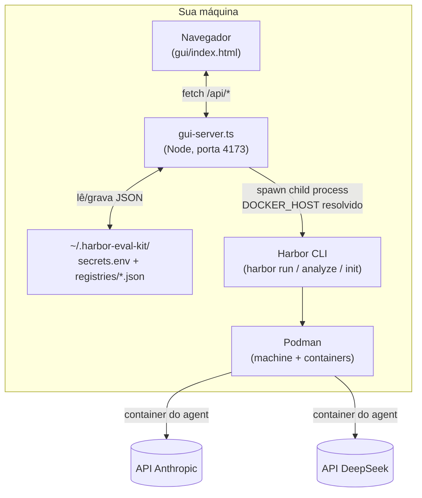
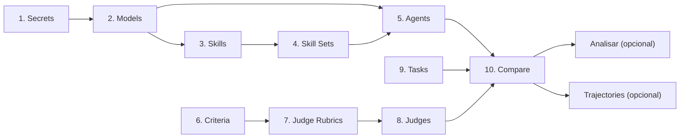
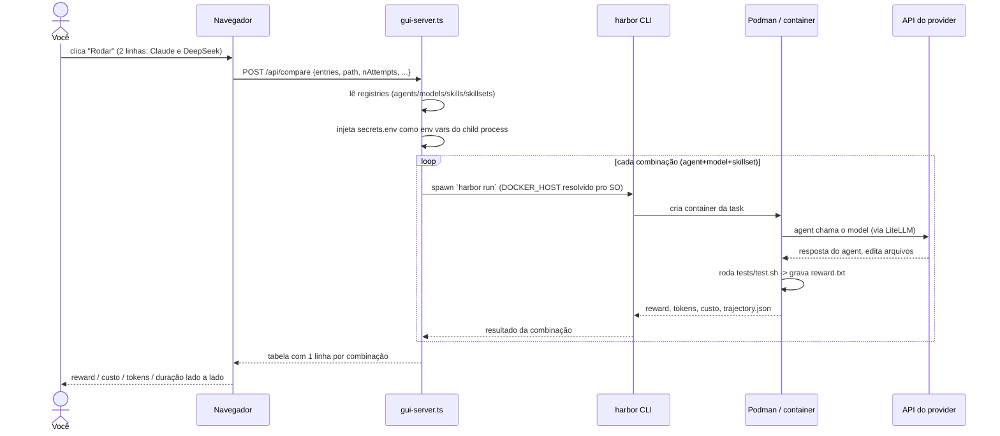

# Como funciona, na prática — guia com diagramas e uma história de uso

Este documento complementa o [`DOCUMENTACAO.md`](../DOCUMENTACAO.md) (referência completa,
aba por aba) com duas coisas que ficam mais fáceis de ver do que de ler em prosa:

1. **Diagramas** de arquitetura e do fluxo de uma execução real.
2. Uma **história de uso** ponta a ponta — comparando **DeepSeek vs Claude** na mesma task
   Python, incluindo um erro real de chave inválida que aconteceu durante os testes deste kit
   (fica como exemplo de troubleshooting, não é hipotético).

Se você só quer o mapa rápido das abas, o README já cobre isso. Aqui o foco é *como as peças
se encaixam* e *como é usar isso do começo ao fim*.

## 1. Visão geral — quem fala com quem

Tudo roda **localmente**. Não existe página hospedada, não existe backend remoto — o
`gui-server.ts` é um processo Node na sua própria máquina, e ele só sabe conversar com o que
está no seu disco e com o `harbor`/`podman` instalados localmente.



Pontos que valem destacar (detalhados no `DOCUMENTACAO.md` §3, §6 e §7):

- O navegador **nunca** fala direto com Harbor/Podman — sempre passa pelo `gui-server.ts`.
- As chaves de API só existem em `secrets.env`, fora do repositório, e só entram no ambiente
  do processo `harbor`/`podman` no exato momento da chamada — nunca voltam numa resposta HTTP.
- Quem realmente fala com a API do provider (Anthropic, DeepSeek, ...) é o **container** onde
  o agent está rodando, não o `gui-server.ts` — a exceção é o botão **Test** da aba Secrets,
  que faz uma chamada mínima direto (via LiteLLM) para confirmar a chave antes de gastar uma
  run inteira com ela.

## 2. A ordem cognitiva das abas, visualmente

A numeração 1→10 na GUI não é decorativa — cada aba depende do que foi cadastrado nas
anteriores. Este é o mesmo fluxo do `DOCUMENTACAO.md` §9, só que como grafo:



`Datasets`, `Trajectories` e `Analyze` ficam fora dessa cadeia de pré-requisitos — são
ferramentas de apoio, usadas quando fazem sentido, não passos obrigatórios.

## 3. O que acontece quando você clica "Rodar" no Compare

Este é o caminho de execução real, por trás de um clique só:



O **Analisar** (Judge/LLM) é uma chamada **separada e opcional**, disparada depois, por linha
ou em lote — nunca acontece automaticamente dentro do loop acima. Ver `DOCUMENTACAO.md` §11.

## 4. História de uso: DeepSeek vale a pena para tasks Python do time?

**Contexto.** Rafael quer saber se dá pra trocar Claude por DeepSeek (bem mais barato) nas
tasks Python do dia a dia, sem perder qualidade — e quer isso com números, não achismo.

### 4.1 — Cadastrar e testar as duas chaves (aba 1. Secrets)

1. Provider = `Anthropic` → Name preenche sozinho `ANTHROPIC_API_KEY`, cola o Value → **Save
   key**.
2. Provider = `DeepSeek` → Name preenche `DEEPSEEK_API_KEY`, cola o Value → **Save key**.
3. Clica **Test** em `DEEPSEEK_API_KEY`.

Foi exatamente aqui que aconteceu um erro real durante os testes deste kit — fica registrado
porque é um bom exemplo do que o botão Test é *pra* pegar:

```
Erro: BadRequestError: litellm.BadRequestError: DeepseekException -
{"error":{"message":"Authentication Fails, Your api key: ****1532 is invalid",
"type":"authentication_error","param":null,"code":"invalid_request_error"}}
```

A chave tinha sido revogada no painel da DeepSeek depois de salva aqui. Solução: gerar uma
chave nova em platform.deepseek.com, colar de novo em **Value**, **Save key** (sobrescreve),
**Test** de novo:

```
✓ Key funciona — chamada de teste no model deepseek/deepseek-chat respondeu normalmente.
```

Repete o **Test** em `ANTHROPIC_API_KEY` e confirma o mesmo `✓`. Como as duas chaves suportam
listagem ao vivo de modelos, a GUI mostra um checklist dos modelos descobertos — deixa
marcado, é o próximo passo de qualquer forma.

### 4.2 — Registrar os dois models (aba 2. Models)

Do checklist que apareceu no Test (ou cadastrando à mão):

| Label | provider/model |
|---|---|
| `claude-sonnet-5` | `anthropic/claude-sonnet-5` |
| `deepseek-chat` | `deepseek/deepseek-chat` |

As duas linhas mostram o badge verde de chave configurada.

### 4.3 — Skills / Skill Sets (abas 3 e 4)

Pulado nesta história de propósito: para a comparação ser justa, as duas linhas do Compare
vão usar exatamente as mesmas instruções extras (nenhuma) — variar só o model. Se Rafael
quisesse testar se uma skill de "boas práticas Python" muda o resultado, isso viraria uma
*segunda* comparação (skill ablation, ver `docs/EXPERIMENTS.md`), não a mesma.

### 4.4 — Dois perfis de Agent (aba 5. Agents)

| Nome | agent (Harbor) | model padrão |
|---|---|---|
| `claude-code-anthropic` | `claude-code` | `claude-sonnet-5` |
| `claude-code-deepseek` | `claude-code` | `deepseek-chat` |

> **Honestidade:** este kit só passa o `model` escolhido para o adapter `--agent` que o Harbor
> vai rodar — se aquele adapter específico realmente sabe usar um model fora do provider que
> ele foi desenhado para (aqui, um adapter chamado `claude-code` recebendo um model DeepSeek) é
> uma questão do Harbor e do adapter em si, não algo que esta GUI controla ou garante. Confirme
> com `harbor run --help` / a documentação do adapter antes de tirar conclusões de custo se o
> seu Harbor instalado for estrito quanto a isso. Nesta história assumimos que funciona, para
> ilustrar o mecanismo de comparação — o ponto é *como* comparar, não uma promessa de
> compatibilidade universal.

### 4.5 — Um rubric simples pro Judge (abas 6 e 7)

- Criteria: `no_prolixity` — "o código resolve o problema sem complexidade desnecessária,
  sem funções/imports não usados, sem comentários redundantes."
- Judge Rubric: `Python Quality` — agrupa `no_prolixity` (e outros critérios que já existirem).

### 4.6 — Um Judge de alto nível (aba 8. Judges)

`quality-judge`: agent = `claude-code`, model = `claude-sonnet-5` (obrigatoriamente da lista
curada high-tier — nunca o modelo barato padrão do Harbor), rubrics padrão = `Python Quality`.

### 4.7 — A task (aba 9. Tasks)

`harbor init --task` gera o esqueleto; Rafael edita:
- `instruction.md`: "some duas frações e devolva o resultado simplificado".
- `environment/Dockerfile`: imagem Python oficial.
- `tests/test.sh`: roda pytest, grava 0/1 em `/logs/verifier/reward.txt`.

Task salva como `time/soma-fracoes`.

### 4.8 — Rodar a comparação (aba 10. Compare)

1. Task: `time/soma-fracoes`.
2. Adiciona linha com Agent `claude-code-anthropic` (model já vem pré-preenchido).
3. Adiciona linha com Agent `claude-code-deepseek`.
4. `n-attempts = 3` (reduz ruído de amostra pequena), `concurrency = 2`.
5. **Rodar.**

Resultado (exemplo real de ordem de grandeza, não um benchmark oficial):

| Agent | Model | Reward médio | Custo total | Duração |
|---|---|---|---|---|
| claude-code-anthropic | claude-sonnet-5 | 1.0 (3/3) | $0.018 | 42s |
| claude-code-deepseek | deepseek-chat | 0.67 (2/3) | $0.002 | 51s |

DeepSeek saiu ~9x mais barato, mas falhou 1 das 3 tentativas.

### 4.9 — Analisar a tentativa que passou no reward (opcional)

Antes de decidir, Rafael clica **Analisar** na linha do DeepSeek com `quality-judge` +
`Python Quality`: quer saber se as 2 tentativas que passaram fizeram isso de forma limpa ou
"hackeando" o teste (ex.: hard-code do valor esperado). O Judge é um agent Harbor de verdade
com acesso aos arquivos do trial (`result.json`, `trajectory.json`, `test-stdout.txt`), não
uma chamada de LLM crua — então a resposta cita trechos reais do código gerado.

### 4.10 — Ver a tentativa que falhou (Trajectories)

Na linha do DeepSeek, **Ver trajetórias** abre o `harbor view` daquele job — Rafael vê
passo a passo onde o agent se perdeu (nesse exemplo: confundiu `math.gcd` com uma
implementação própria incorreta de MDC).

### 4.11 — Decisão

Reward + custo já é a comparação real (`DOCUMENTACAO.md` §11); o Judge só confirmou que as
tentativas do DeepSeek que passaram foram honestas, não sorte. Decisão registrada: DeepSeek
como filtro barato de primeira passada nas tasks simples do time; Claude para as tasks
consideradas críticas, onde o ganho de confiabilidade compensa o custo maior.

## 5. Onde ir a partir daqui

- **O que precisa estar cadastrado antes de cada operação, e por quê**:
  [`FLUXO_RUN_COMPARE_ANALYZE.md`](./FLUXO_RUN_COMPARE_ANALYZE.md) — obrigatório vs. opcional
  por operação, a cadeia Secret → Model → Judge, e as mensagens de erro reais.
- Mecanismo completo de reward vs. Judge: [`DOCUMENTACAO.md` §11](../DOCUMENTACAO.md#11-o-mecanismo-de-avaliação--reward-vs-juiz).
- Receitas de comparação (model vs model, agent vs agent, skill ablation): [`docs/EXPERIMENTS.md`](./EXPERIMENTS.md).
- Rodar a mesma comparação via linha de comando (CI, sweeps reprodutíveis): [`README.md` — CLI](../README.md#two-ways-to-use-it).
