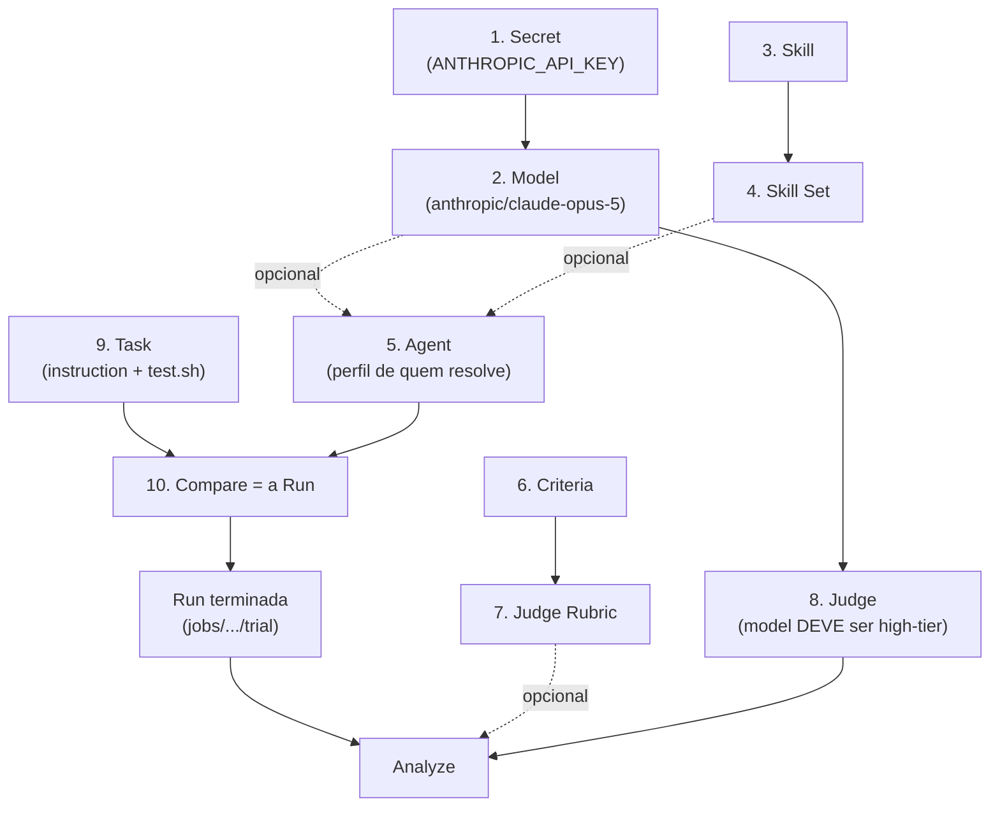

# Run, Compare e Analyze — o que precisa estar cadastrado, e por quê

Este documento responde uma pergunta específica: **"o que eu preciso ter cadastrado antes de
conseguir rodar isso?"** — para cada uma das três operações do kit, com exemplos preenchidos e
as mensagens de erro reais que aparecem quando falta alguma coisa.

- Explicação de cada aba isoladamente: [`DOCUMENTACAO.md` §10](../DOCUMENTACAO.md#10-cada-aba-em-detalhe).
- História ponta a ponta com diagramas: [`COMO_FUNCIONA.md`](./COMO_FUNCIONA.md).
- **Aqui**: a cadeia de pré-requisitos, o *porquê* de cada cadastro existir, e o que quebra se
  ele faltar.

## 1. As três operações

Primeiro experimento com LLM: **Começar → Credenciais → Modelos → Agentes → Novo experimento**, usando
`evals/python/soma-fracoes`. Skills, Criteria, Rubrics e Judges são opcionais. GUI e CLI
persistem planos e resultados em `<jobsDir>/.experiments/<id>/`; cada execução recebe IDs
novos, e o registro pode ser reaberto sem reaproveitar um job antigo como se fosse novo.

| Operação | O que é | Comando Harbor por trás |
|---|---|---|
| **Run** | uma execução: um agent tenta resolver uma task dentro de um container, e o `test.sh` dá o reward | `harbor run` |
| **Compare** | N runs em sequência (uma por combinação agent+model+skillset), lado a lado na mesma tabela | N × `harbor run` |
| **Analyze** | um juiz LLM lê uma run **já terminada** e responde PASS/FAIL/N-A por critério | `harbor analyze` |

Não existe "run" isolada na GUI: **Novo experimento é como você roda**. Uma run só é uma Compare
com uma linha só. O CLI (`compare-matrix.ts`) segue a mesma ideia.

O argv lógico montado para cada linha (de `buildHarborRunArgs`):

```bash
harbor run \
  --path <task> --agent <agentValue> --env docker \
  --jobs-dir <jobs> --job-name <nome-gerado> --n-attempts <N> \
  [--model <provider/modelo>] [--skill <pasta>]...
```

Antes do spawn, `execHarbor` troca `--env docker` pelo adapter
`harbor_eval_kit.managed:ManagedPodmanEnvironment`. O nome `docker` permanece como entrada
compatível na GUI/CLI; nenhuma execução local chama Docker Engine.

Cada candidato possui dois níveis de observabilidade. O executor cria primeiro
`<jobsDir>/.experiments/<id>/logs/<candidateId>.log`, que captura stdout/stderr já mascarados,
inclusive falhas de gate ou spawn anteriores à criação do job pelo Harbor. Depois que o Harbor
inicia o job, seus próprios artefatos ficam em `<jobsDir>/<jobName>/job.log` e
`<jobsDir>/<jobName>/<trial>/trial.log`; a trajetória estruturada fica em
`<jobsDir>/<jobName>/<trial>/agent/trajectory.json`.

Repare: `--model` e `--skill` são **condicionais**. É isso que torna Model e Skill opcionais
em vez de obrigatórios — o que a tabela abaixo detalha.

### 1.1 Nem todo agent aceita qualquer model

O catálogo `HARBOR_AGENTS` espelha os adapters registrados no `AgentFactory` do Harbor 0.22.0, e a diferença
entre eles decide se uma comparação model-vs-model é possível:

- **Model-agnostic** (LiteLLM por baixo — aceitam qualquer `provider/modelo`):
  `mini-swe-agent`, `terminus-2`, `aider`, `opencode`, `openhands`,
  `openhands-sdk`, `swe-agent`, `goose`, `langgraph`, `cline-cli`, `dspy-rlm`, `deerflow`,
  `trae-agent`. **Use um destes** para trocar só o model mantendo o resto igual.
- **CLIs de um fornecedor** (falam a API do próprio fornecedor): `claude-code`, `codex`,
  `gemini-cli`, `cursor-cli`, `copilot-cli`, `qwen-coder`, `kimi-cli`… Passar um model de
  outro provider para eles é problema do adapter, não algo que este kit garanta.
- **Sem custo de API**: `oracle` (aplica o `solution/solve.sh` da própria task) e `nop` (não
  faz nada).

O campo `--agent value` na aba Agentes tem autocomplete vindo desse catálogo, marcando quais são
model-agnostic — a fonte é `HARBOR_AGENTS` em `scripts/lib/catalog.ts`, servida por
`GET /api/harbor-agents`. É um espelho mantido à mão do `AgentFactory` (o Harbor não expõe
essa lista de forma legível por máquina — `harbor agent list` não existe), então revalide ao
atualizar o Harbor.

## 2. Tabela mestre de pré-requisitos

| Cadastro | Run/Compare | Analyze | Por que existe |
|---|---|---|---|
| **1. Secret** (chave do provider) | **obrigatório** se o model usado for de API paga | **obrigatório** (o juiz é sempre um model pago) | é o que autentica a chamada; injetado só no processo filho, na hora |
| **2. Model** | opcional | **obrigatório** | sem ele o Harbor usa o model padrão dele; com ele você controla e compara |
| **3. Skill** | opcional | ignorado | instruções extras entregues ao agent (`--skill`) |
| **4. Skill Set** | opcional | ignorado | agrupa skills pra tratar como uma unidade comparável |
| **5. Agent** | **obrigatório** | opcional | é a linha do Compare; define quem resolve, com que model padrão |
| **Adapter model-agnostic** | necessário p/ comparar providers | idem | só `mini-swe-agent`, `terminus`, `aider` e cia. aceitam qualquer `provider/modelo` — ver §2.1 |
| **6. Criteria** | não usado | opcional | as perguntas individuais que o juiz responde |
| **7. Judge Rubric** | não usado | opcional | agrupa critérios; sem rubric, o Harbor usa o padrão dele |
| **8. Judge** | não usado | **obrigatório na prática** | quem julga: agent + model high-tier + instruções |
| **9. Task** | **obrigatório** | herdado da run | o problema em si + o teste que gera o reward |
| **Run terminada** | — | **obrigatório** | o Analyze lê o trial no disco; não existe julgar o que não rodou |

> **A regra que mais confunde:** Criteria/Rubrics/Judges **não participam da Run**. Eles só
> existem para o Analyze, que é uma etapa *posterior e opcional*. Se você só quer saber
> "passou ou não passou", o reward do `test.sh` já responde — não precisa cadastrar nada das
> abas 6, 7 e 8.

## 3. A cadeia de dependências



Linha cheia = obrigatório. Linha pontilhada = opcional.

## 4. Caminho mínimo — sua primeira run sem gastar 1 centavo de API

Serve para validar que o kit inteiro funciona antes de envolver dinheiro.

1. **Tasks**: crie uma task (`harbor init --task`), preencha `instruction.md` e
   `tests/test.sh`. Preencha também `solution/solve.sh`, porque o passo 3 depende dele.
2. **Agentes**: cadastre um agent com `agentValue = oracle` e **sem model**.
   - `oracle` não chama LLM nenhuma: ele aplica a `solution/solve.sh` da própria task.
   - Serve para responder *"meu `test.sh` está correto?"* — se o oracle não tira reward 1.0,
     o problema está na sua task, não no agent.
   - (`nop` é o oposto: não faz nada, deve tirar 0.0. Confirma que o teste não passa sozinho.)
3. Em **Novo experimento**: escolha a task, adicione a linha do agent `oracle`, **Rodar**.

Nenhum Secret, nenhum Model, nenhum Criteria, nenhum Judge foi necessário aqui.

## 5. Caminho completo — um Compare de verdade (DeepSeek vs Claude)

### 5.1 Credencial — porque sem chave não há chamada

Cadastre `ANTHROPIC_API_KEY` e `DEEPSEEK_API_KEY` em **Credenciais**. Em **Modelos**, registre
os valores exatos que vai usar, por exemplo `anthropic/claude-sonnet-5` e
`deepseek/deepseek-v4-flash`. Volte a **Credenciais**, selecione cada Model compatível e clique
**Testar modelo escolhido**. O teste faz uma chamada real (`"hi"`, `max_tokens: 8`) nesse modelo
exato; salvar a credencial não faz teste automático.

**Descobrir modelos** é uma operação separada e sob demanda. Ela consulta o catálogo do
provider, não faz completion, e a GUI só cadastra modelos que você marcar explicitamente.

Se faltar a chave do provider do model que você escolheu, a run falha **dentro do container**,
depois de já ter subido tudo — por isso testar aqui economiza tempo.

### 5.2 Modelos — porque é o que você quer comparar

| Label | Value |
|---|---|
| `claude-sonnet-5` | `anthropic/claude-sonnet-5` |
| `deepseek-v4-flash` | `deepseek/deepseek-v4-flash` |

O prefixo antes da `/` é o que decide qual Secret será lido — convenção do LiteLLM, não uma
escolha separada. O badge na lista mostra se a chave esperada já existe.

### 5.3 Agentes — porque é a unidade de comparação

| Label | agentValue | Model padrão |
|---|---|---|
| `resolvedor-claude` | `mini-swe-agent` | `claude-sonnet-5` |
| `resolvedor-deepseek` | `mini-swe-agent` | `deepseek-v4-flash` |

Você **pode** cadastrar um agent só e sobrescrever o model direto na linha do Compare — o
resultado é idêntico. Dois perfis só evitam repetir o override toda vez.

### 5.4 Novo experimento

Task + duas linhas + `n-attempts = 3` (reduz ruído de amostra pequena) → **Rodar**.

Resultado: uma linha por combinação, com reward, custo (USD), tokens in/out e duração.

**Esse reward já é a comparação real.** Determinístico, sem LLM opinando. O Analyze abaixo é
uma camada extra e opcional.

## 6. Caminho do Analyze — e por que ele exige Judge

O Analyze responde o que o reward não consegue: *"passou, mas passou honestamente?"* e
*"entre dois que passaram, qual fez melhor?"*.

### 6.1 Por que um Judge precisa ser cadastrado

O endpoint recusa qualquer model que não esteja na lista curada high-tier:

```
the judge's model must be one of the curated high-tier judge models (see GET /api/judge-models)
```

A lista (`JUDGE_MODELS` em `scripts/lib/catalog.ts`) é hoje:

| Label | Value |
|---|---|
| Claude Opus 5 | `anthropic/claude-opus-5` |
| Claude Fable 5.1 | `anthropic/claude-fable-5-1` |
| GPT-5.1 | `openai/gpt-5.1` |
| Gemini 3 Pro | `gemini/gemini-3-pro` |

**Motivo:** a lista é uma política operacional para o juiz opcional. Preço ou presença na
lista não demonstram qualidade; calibre o modelo com exemplos de veredito conhecido.
O padrão do Harbor (`claude-haiku-4-5`) fica fora dessa política, salvo modo validação explícito.

**Escape hatch — "Modo validação".** Para *conferir se o Analyze funciona na sua máquina* sem
pagar um model high-tier, marque "Modo validação" nos **dois** lugares: na aba 8 (Judges), que
libera o dropdown a listar todos os models cadastrados, cada um fora da lista marcado com
`⚠ fora da lista curada`; e no painel Analisar (aba Compare), que envia `validationMode: true`
na chamada. Sem o flag nas duas pontas o gate recusa normalmente — não existe afrouxamento
silencioso — e a resposta sai carimbada (`validationMode: true` + aviso na tela) para que o
veredito nunca seja confundido com avaliação real. Validado em 2026-09-06 com
`deepseek/deepseek-chat` julgando uma run real (registro histórico): `clean_code: pass`, `no_prolixity: pass`,
`analysis.json` gravado e renderizado corretamente por centavos.

**Consequência prática — a cadeia inteira que um Judge exige:**

```
Secret (ANTHROPIC_API_KEY)  →  Model (anthropic/claude-opus-5)  →  Judge
```

Ou seja: você **não consegue** cadastrar um Judge útil sem antes registrar, na aba Modelos, um
model cujo value seja exatamente um dos quatro acima. É o erro de ordem mais comum — o dropdown
de model do Judge aparece vazio e não fica óbvio o porquê.

### 6.2 Criteria e Rubrics são opcionais — e por que existem mesmo assim

Sem rubric marcado, o Harbor usa o rubric padrão dele (`reward_hacking` +
`task_specification`) — já resolve o caso "alguém hackeou o teste?".

Você cadastra Criteria próprios quando quer julgar algo específico do **seu** contexto:

```
name:        no_prolixity
description: O código resolve o problema sem complexidade desnecessária?
guidance:    PASS se a solução é direta e legível. FAIL se há funções/imports não usados,
             abstração prematura, ou comentários que apenas repetem o código.
             N-A se a task não envolve escrever código novo.
```

E o Rubric existe para **reuso**: `no_prolixity` entra tanto num rubric "Python Quality"
quanto num "TypeScript Quality" sem você reescrever o texto. Editou o critério uma vez, todos
os rubrics que o usam já refletem.

Se você marcar um rubric vazio ou com critérios inválidos:

```
rubric has no valid criteria
```

### 6.3 Rodando

Na tabela de resultados do Compare, botão **Analisar** na linha desejada → escolha o Judge →
marque zero ou mais rubrics → cada rubric marcado vira uma chamada separada, com o custo
daquela análise mostrado individualmente.

Cada chamada recebe um `operationId` novo. Enquanto o POST está em andamento,
`GET /api/operations/<operationId>?offset=<N>` expõe status e somente os novos bytes do log já
mascarado. O registro e o log ficam em
`~/.harbor-eval-kit/operations/<operationId>/`; nenhuma credencial, env completo ou argv com
valor secreto é persistido. O job interno do Harbor recebe nome
`harbor-eval-kit-analysis-<operationId-sem-hífens>` e o mesmo `--jobs-dir` do experimento, o que
torna `job.log`, `trial.log` e a trajetória do juiz localizáveis durante a chamada.

Ao concluir uma análise de um trial, Harbor grava `analysis.json` no próprio trial analisado.
Ao analisar um job com vários trials, cada trial recebe seu artefato e o relatório agregado fica
no job interno. O experimento registra cada
rubric da rodada com `analysisBatchId`, posição e tamanho do lote; resultados parciais ou em modo
validação não viram ranking.

O nome determinístico do job permanece no registro para auditoria, mas a GUI só oferece **Abrir
este job em Logs** quando `<jobsDir>/<harborJobName>` existe de fato. Se esse diretório tiver sido
removido ou estiver ausente, o atalho fica oculto. O `operation.log` e o artefato gravado no
próprio trial continuam disponíveis independentemente desse atalho.

O backend resolve esse caminho canônico pelos argumentos da própria invocação, sem depender da
formatação de `stdout`. Código zero sem `analysis.json` válido termina a operação como falha; não
há resultado bem-sucedido com análise nula.

Se o servidor reiniciar e encontrar uma operação persistida em `starting`/`running` sem prova de
que pertence ao processo atual, a leitura retorna `executionUncertain: true`. A GUI deve parar o
poll contínuo e orientar a inspeção dos logs e do job. O kit não retoma a chamada e não mata um
PID persistido.

O juiz é um agente Harbor de verdade, com acesso a arquivo: ele lê `result.json`,
`agent/trajectory.json` e `test-stdout.txt` dentro do trial antes de responder — não é uma
chamada de LLM crua em cima de um resumo.

**Trajetórias** inicia `harbor view` para inspecionar esses artefatos locais e só aceita e expõe
uma URL HTTP de loopback (`localhost`, `127.0.0.1` ou `::1`). O viewer não executa Run ou
Analyze e não altera resultados. Seu stdout,
stderr, startup, falha e encerramento também são registrados como operação; Stop só confirma
sucesso depois que o processo iniciado pelo kit termina.

## 7. Exemplos de payload (para quem for automatizar)

**Compare** — `POST /api/compare`:

```json
{
  "path": "evals/python/minha-task",
  "entries": [
    { "agentId": "<id-do-resolvedor-claude>" },
    { "agentId": "<id-do-resolvedor-claude>", "modelId": "<id-do-deepseek-v4-flash>" }
  ],
  "env": "docker",
  "jobsDir": "jobs",
  "nAttempts": "3",
  "concurrency": 2
}
```

A segunda entrada mostra o override: mesmo agent, model diferente, só naquela linha.

**Analyze** — `POST /api/analyze`:

```json
{
  "operationId": "<uuid-novo>",
  "path": "jobs/<prefixo-runId-cN>/<trial>",
  "jobsDir": "jobs",
  "judgeId": "<id-do-judge>",
  "rubricId": "<id-do-rubric>"
}
```

`rubricId` pode ser omitido ou `"__default__"` para usar o rubric padrão do Harbor.
Não reutilize `operationId`: o backend responde 409 para preservar o histórico anterior.

**Equivalente em CLI** (produto cartesiano, não lista explícita — ver
[`DOCUMENTACAO.md` §12](../DOCUMENTACAO.md#12-compare-matrixts-cli-vs-gui--quando-usar-cada-um)):

```powershell
node .\scripts\compare-matrix.ts `
  --path .\evals\python\minha-task `
  --agent mini-swe-agent `
  --model anthropic/claude-sonnet-5 --model deepseek/deepseek-v4-flash
```

## 8. Erros reais e o que significa cada um

| Mensagem | Causa | Onde resolver |
|---|---|---|
| `path and at least one entry are required` | rodou Novo experimento sem task ou sem nenhuma linha | Novo experimento |
| `unknown agentId` | o agent foi deletado depois de montar a linha | Agentes, recadastre |
| `no secret named X is saved yet` | testou um Model cuja credencial não foi salva | Credenciais |
| `no known provider maps to the secret name 'X'` | nome de secret customizado, fora dos 15 providers curados | Credenciais (use o dropdown) |
| `the judge's model must be one of the curated high-tier judge models` | Judge sem model, ou com model fora da lista curada | Modelos → cadastre um high-tier → Judges |
| `rubric has no valid criteria` | rubric criado sem marcar nenhum critério válido | Criteria e Judge Rubrics |
| `unknown rubricId` / `unknown judgeId` | cadastro deletado após ter sido pinado numa task | aba 9 (repin) |
| `Authentication Fails, Your api key: ****NNNN is invalid` | a chave é real mas foi revogada/rotacionada no provider | painel do provider → aba 1 |

## 9. Resumo em uma frase

**Para rodar**: Task + Agent (e Secret+Model se o agent usar LLM paga).
**Para comparar**: a mesma coisa, com duas ou mais linhas.
**Para julgar**: uma run terminada + Secret → Model high-tier → Judge (Criteria e Rubric só se
quiser perguntas próprias em vez do padrão do Harbor).

## Fluxo adicional de spec e PR histórico

O assistente fica em **Tasks → Spec de repositório + PR**; conexões reutilizáveis
ficam em **Agentes → Integrações de CLI e harness**. O [guia específico](REPOSITORIOS_E_HARNESSES.md)
explica cada etapa, credenciais Git/API/login nativo, calibração sem juiz, evidências
somente por diff, export/import de receitas e fallback manual. Use apenas fontes
confiáveis; diagnóstico no host não certifica a sessão do CLI em container.
