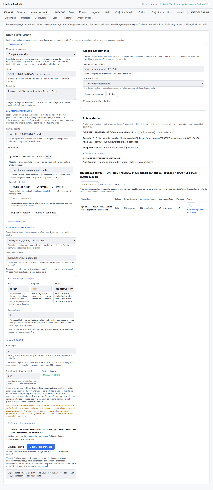
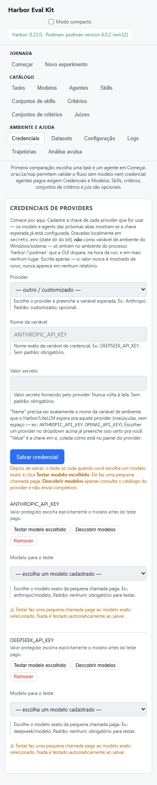
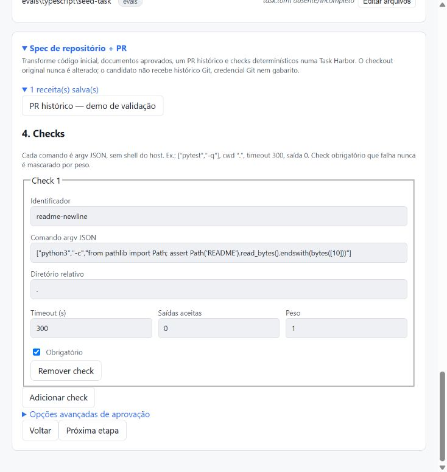
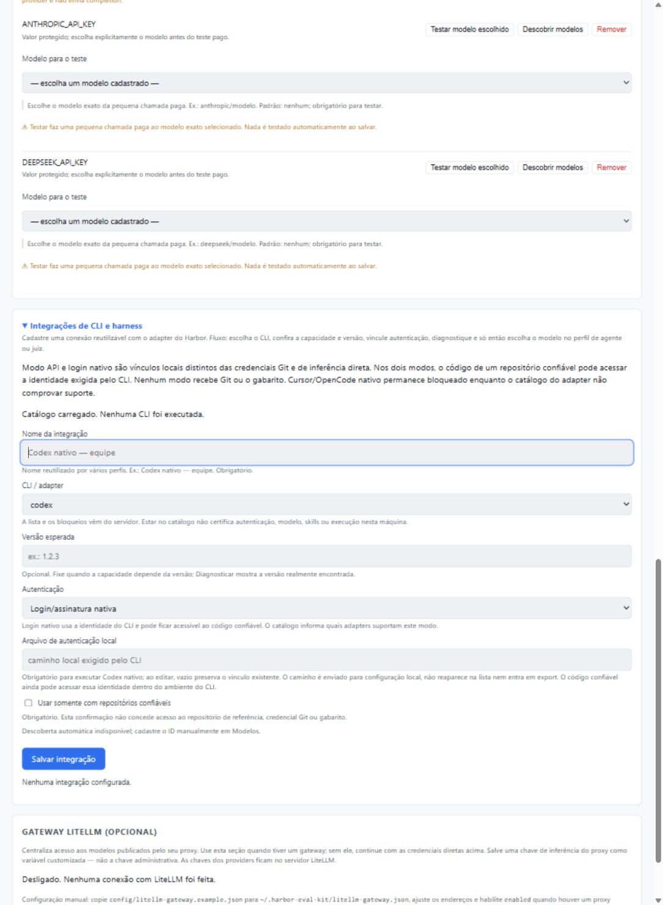
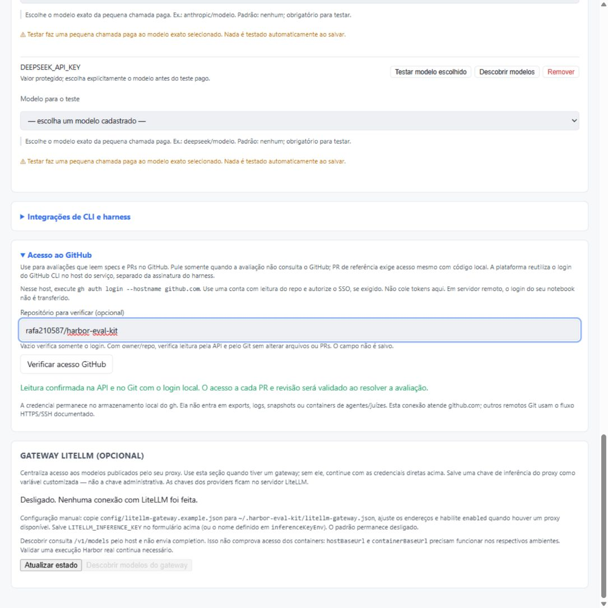

# Guia visual da plataforma

O Harbor Eval Kit organiza a avaliação em três momentos: preparar o catálogo,
executar um experimento e investigar seus resultados. Não é necessário preencher
todas as abas para começar.

**Primeira execução sem API:** Começar → Tasks → Agentes (`oracle` e `nop`) →
Novo experimento → prévia → dry run → execução. Escolha uma task com solução de
referência, como `evals/python/soma-fracoes`, e valide o ambiente com o doctor antes.

**Comparação de modelos:** Credenciais → Modelos → Agentes → Novo experimento.
Duplique o candidato e altere somente o modelo. Skills e juiz são opcionais.

Veja os pré-requisitos no [README](../README.md#início-rápido), a configuração por
sistema na [instalação manual](INSTALACAO_MANUAL.md) e os detalhes de cada campo no
[manual](../DOCUMENTACAO.md#10-cada-área-em-detalhe).

## Capturas da UI

Estas imagens foram capturadas na UI real durante as jornadas de 07–08/09/2026
e reutilizadas sem edição. Não são mockups nem resultados simulados. Os nomes QA
identificam cadastros de teste já removidos; os caminhos ilustram aquela máquina.
Nenhum valor de credencial aparece nas capturas.

| Captura | O que observar |
|---|---|
| [Novo experimento, desktop](screenshots/compare-tab.png) | Configuração à esquerda; prévia, histórico e resultado à direita. Mostra um cancelamento intencional do teste Oracle, não uma comparação de qualidade |
| [Credenciais, largura de 390 px](screenshots/credenciais-mobile.png) | Provider, nome da variável, campo de valor vazio e escolha explícita de modelo para testar. A lista mostra nomes de variáveis, nunca chaves |

Ver Novo experimento — configuração, prévia e resultado

Ver Credenciais — formulário e teste por modelo em tela estreita

As jornadas e os custos medidos estão no [relatório de testes reais](JORNADAS_REAIS_UI_2026-09-07.md).
Estas capturas não representam uma nova validação de macOS/Linux ou de todos os adapters.
O arquivo anterior `screenshots/compare-tab.jpg` permanece preservado como material
histórico; a imagem usada neste guia é `compare-tab.png`.

## Mapa das abas

| Aba | Para que serve | Quando usar |
|---|---|---|
| [Começar](#começar) | Checklist e atalhos por objetivo | Primeiro acesso ou dúvida sobre o próximo passo |
| [Novo experimento](#novo-experimento) | Candidatos, prévia, execução e histórico | Comparar modelos, agentes ou skills |
| [Tasks](#tasks) | Instrução, ambiente, solução e verificador | Escolher ou editar o problema avaliado |
| [Modelos](#modelos) | Nome amigável e identificador do provider | Preparar candidatos ou o juiz |
| [Agentes](#agentes) | Adapter, modelo e instruções padrão | Definir quem resolve a task |
| [Skills](#skills) | Instruções reutilizáveis e arquivos auxiliares | Ensinar um procedimento ao agente |
| [Conjuntos de skills](#conjuntos-de-skills) | Agrupar skills | Aplicar ou comparar um pacote de instruções |
| [Critérios](#critérios) | Perguntas verificáveis para o juiz | Definir o que será avaliado após a execução |
| [Conjuntos de critérios](#conjuntos-de-critérios) | Agrupar critérios, também chamados rubrics | Reutilizar o mesmo protocolo de julgamento |
| [Juízes](#juízes) | Adapter, modelo, prompt e conjuntos padrão | Escolher quem analisa os resultados |
| [Credenciais](#credenciais) | Chaves locais dos providers | Antes de chamadas pagas; dispensável para oracle/nop |
| [Datasets](#datasets) | Obter coleções de tasks | Ampliar a avaliação para vários problemas |
| [Configuração](#configuração) | Exportar/importar o catálogo | Compartilhar configurações sem credenciais |
| [Logs](#logs) | Ler arquivos persistidos da execução | Investigar progresso, falhas e saída do verificador |
| [Trajetórias](#trajetórias) | Abrir o viewer do Harbor | Inspecionar passos, comandos e respostas do agente |
| [Análise avulsa](#análise-avulsa) | Julgar um job ou trial existente | Analisar resultados de outra sessão ou da CLI |

## Começar

O checklist indica o que falta e oferece atalhos para comparar modelos, comparar
agentes, avaliar skills ou montar uma combinação livre. Escolha o objetivo que
representa sua pergunta; não cadastre skills ou juiz só para completar a tela.

## Novo experimento

1. Escolha o modo e dê um título que descreva a comparação.
2. Adicione o perfil de agente. Duplique o candidato para variar apenas uma dimensão;
   marque uma baseline para facilitar a leitura das diferenças.
3. Selecione a task e o número de tentativas. Revise modelo, skills e volume na prévia.
4. Faça um dry run para validar a configuração antes de executar.
5. Consulte reward, custo reportado, logs e julgamento na tabela. Use o histórico
   para reabrir o experimento salvo, sem refazer chamadas.

O teto exibido é uma guarda antes da execução, não um limite rígido durante a run.
Custos não reportados pelo Harbor permanecem sem valor. Uma task simples valida o
funcionamento do fluxo, mas não demonstra superioridade geral de um modelo.

## Tasks

Selecione uma task e confira a instrução, o ambiente, a solução de referência e o
verificador. O verificador define o reward determinístico. Use os templates para
criar um problema novo; um stub precisa ser completado antes de servir de benchmark.
Uma task também pode definir o juiz e os conjuntos de critérios preferidos.

## Modelos

Cadastre um nome legível e o identificador completo aceito pelo provider/adapter.
Exemplo: nome **DeepSeek Flash**, identificador `deepseek/deepseek-v4-flash`.
A descoberta consulta o catálogo do provider; ela não comprova compatibilidade com
todos os adapters. O teste de conexão faz uma chamada real e pode ter custo.

## Agentes

O perfil combina o adapter do Harbor, modelo padrão, instruções e conjuntos de
skills padrão. Para comparar modelos, reutilize o mesmo perfil e sobrescreva o
modelo em cada candidato. `oracle` executa a solução de referência; `nop` não faz
nada. Ambos ajudam a validar o ambiente sem API de modelo.

## Skills

Escreva ou envie um `SKILL.md`, acrescente arquivos de apoio ou aponte para uma
pasta existente. Uma skill descreve um procedimento que o agente deverá seguir.
Exemplo: executar os testes e conferir a saída antes de concluir. Não coloque
credenciais nas instruções nem nos arquivos auxiliares.

## Conjuntos de skills

Selecione uma ou mais skills e salve um conjunto com nome claro. Para medir seu
efeito, compare duas linhas com a mesma task, agente e modelo: uma sem skills e
outra com o conjunto. Confira também os defaults do perfil na prévia efetiva.

## Critérios

Cada critério contém nome, descrição e orientação de julgamento. Prefira evidências
observáveis: por exemplo, verificar se a saída cumpre o contrato da task. Evite
critérios vagos como “código bom”. Os critérios do juiz complementam o verificador;
eles não alteram retroativamente o reward.

## Conjuntos de critérios

Agrupe critérios reutilizáveis sob um nome, como **Python — correção funcional**.
Esses conjuntos são as rubrics. A relação é Critério → Conjunto → Juiz; um mesmo
critério pode integrar vários conjuntos.

## Juízes

Escolha adapter, modelo e **Conjuntos de critérios padrão**. Esses vínculos ficam
visíveis no perfil e são herdados quando você seleciona o juiz. A task pode trazer
sua própria seleção; revise os critérios antes de analisar. Os inputs da sessão
são congelados para manter o julgamento consistente entre candidatos.

O modo validação permite testar o fluxo com modelos baratos, incluindo DeepSeek,
sem usar a nota como ranking de qualidade. O juiz usa prompt e critérios; o Harbor
pinado não oferece a mesma injeção de skills disponível ao agente que resolve a task.

## Credenciais

Selecione o provider e cadastre sua chave somente nesta área. O armazenamento é
local, fora do repositório; a API de listagem retorna nomes, nunca os valores.
Não preencha a chave ao tirar prints. Oracle/nop dispensam esta etapa. Testar uma
credencial chama o provider de verdade e exige escolher um modelo.

## Datasets

Escolha a coleção e o destino local. Após obter as tasks, selecione o caminho em
Novo experimento. Para a primeira execução, prefira uma task pequena já disponível;
um dataset inteiro pode aumentar bastante o volume de trials e o custo.

## Configuração

Exporte o catálogo e importe o bundle em outra instalação. O bundle transporta
configurações e referências; cada máquina cadastra suas próprias credenciais.
Credenciais ficam excluídas da exportação. Se houver conteúdo sensível detectado
em instruções ou outros campos, o download é bloqueado antes de gerar o arquivo.

## Logs

Use **Logs** na linha do resultado para abrir a pasta/job correspondente, escolha
o arquivo e ative o acompanhamento quando necessário. A saída inicial do processo
fica disponível no próprio experimento, mesmo antes de o Harbor criar um trial.

| Origem | Local no disco |
|---|---|
| Candidato / dry run | `<jobsDir>/.experiments/<id>/logs/candidate-N.log` |
| Execução Harbor | `<jobsDir>/<job>/job.log` e `<trial>/trial.log` |
| Verificador | Arquivos em `<trial>/verifier/` |
| Análise / viewer | `~/.harbor-eval-kit/operations/<uuid>/operation.log` |

## Trajetórias

Informe a pasta de jobs e inicie o viewer. Abra job, task e trial para inspecionar
comandos, respostas, arquivos e verificador. Use **Parar** ao terminar. O viewer
mostra os artefatos já produzidos; abri-lo não executa novamente o candidato.

## Análise avulsa

Informe um job ou trial existente, selecione o juiz e confira os conjuntos de
critérios herdados. A **Pasta de trabalho da análise** é o destino dos arquivos do
juiz, separado do resultado inspecionado. Executar a análise faz novas chamadas do
juiz e pode ter custo; o cartão da operação mostra estado, tempo, caminho e log.

Para analisar candidatos de um experimento aberto, prefira os botões da própria
tabela em Novo experimento, que mantêm o julgamento associado ao histórico.

## Repositório + PR e integrações CLI

As capturas seguintes mostram a UI real de 08/09/2026, com dados de teste sem valores
secretos. A conexão ilustrativa não foi salva; o cadastro QA usado na validação
foi removido. Diagnóstico do host não certifica autenticação/execução no container.

A etapa Checks concentra comandos, diretórios, timeouts, saídas e pesos. O limiar
fica em Opções avançadas de aprovação e mantém 1 como padrão. A fonte,
os documentos e o PR ficam nas etapas anteriores; ambiente e juiz ficam recolhidos
na revisão. A importação preenche o assistente sem gravar antes de Salvar.

Credenciais mantém uma seção recolhível de conexões. No modo API, o formulário vincula o nome da variável; em assinatura, mostra o
vínculo de sessão específico do CLI. A conexão é selecionada em Agentes e Juízes.
O [guia do fluxo](REPOSITORIOS_E_HARNESSES.md) detalha pré-requisitos e limitações.

